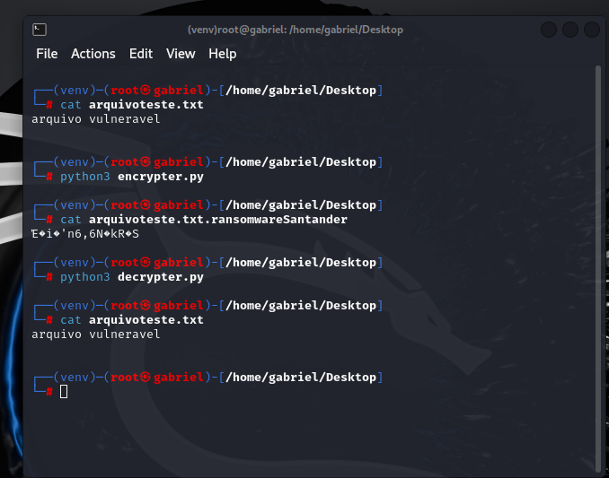

# RansomwarePython
Desenvolvimento de dois scripts para simulação de um ransomware, utilizando as bibliotecas OS (interação com o sistema operacional) e PYAES (para criptografia), atendendo assim a proposta solicitada.

